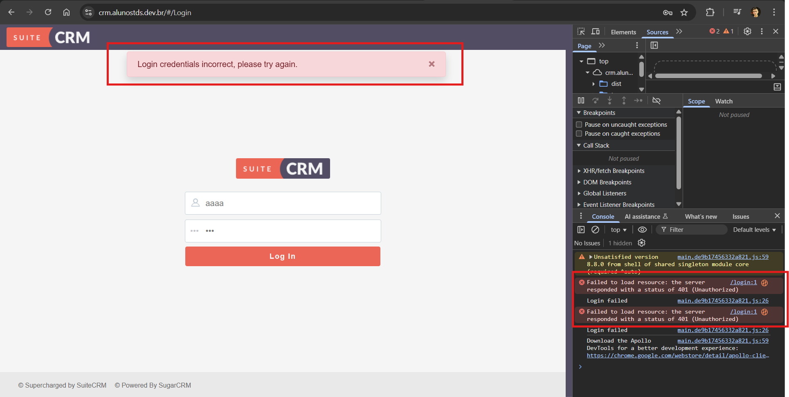

### **Test Case 2 – Invalid Login Attempt**

**Date:** 2025-04-18

---

### Description

This test verifies that the SuiteCRM login functionality appropriately handles invalid login attempts and displays relevant error messages.

### Objective

To evaluate the system's response when incorrect login credentials are entered and confirm that error messages are displayed clearly and accurately.

### What is Being Tested

Authentication validation, error messaging, and security behavior of the login functionality in SuiteCRM.

### Prerequisites

- Access to the SuiteCRM instance at [http://crm.alunostds.dev.br](http://crm.alunostds.dev.br) using a supported browser (Chrome, Firefox, or Edge).
- Stable internet connection.

### Test Procedure

1. Navigate to [http://crm.alunostds.dev.br](http://crm.alunostds.dev.br).
2. Enter an invalid combination of username and password (e.g., `invalidUser` / `wrongPassword`).
3. Click the **Login** button.
4. Observe the behavior and any error message returned by the system.

### Expected Result

The system should deny access and display a clear error message such as "Invalid credentials" or "Unauthorized access." No redirection to the dashboard should occur.

### Actual Result

The application correctly blocked access and returned an error. A lack of authorization was also reflected in the app's internal response, and the HTML displayed a proper error message indicating that the credentials were invalid.

### Result Analysis

✅ The test was successful. Invalid credentials were rejected, and the user remained on the login page with a visible error message.

### Error Description (if applicable)

N/A – The test passed without any unexpected behavior.

### Evidence

- **Invalid Credentials Used:**
  - Username: `invalidUser`
  - Password: `wrongPassword`

- **System Specifications:**
  - OS: Windows 11 Home Single Language, Version 24H2
  - Build: 26100.3775
  - Experience Pack: 1000.26100.66.0
  - Processor: AMD Ryzen 5 5500U with Radeon Graphics 2.10 GHz
  - RAM: 20.0 GB (15.9 GB usable)
  - System Type: 64-bit
  - Browser: Google Chrome Version 135.0.7049.96 (Official build) 64-bit
  - Screen Resolution: 1920x1080

- **Screenshots and/or Video Evidence:**
  - Invalid login:
    
  - Invalid login error:
  

