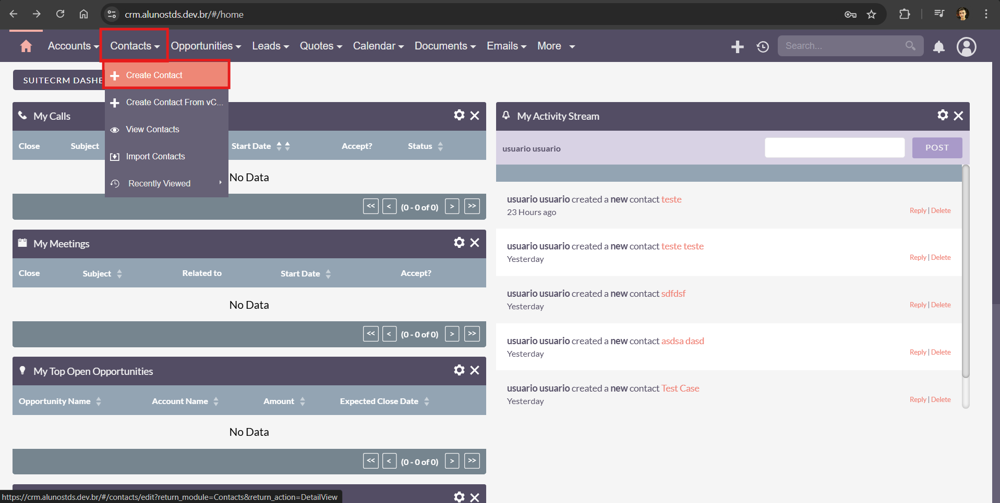
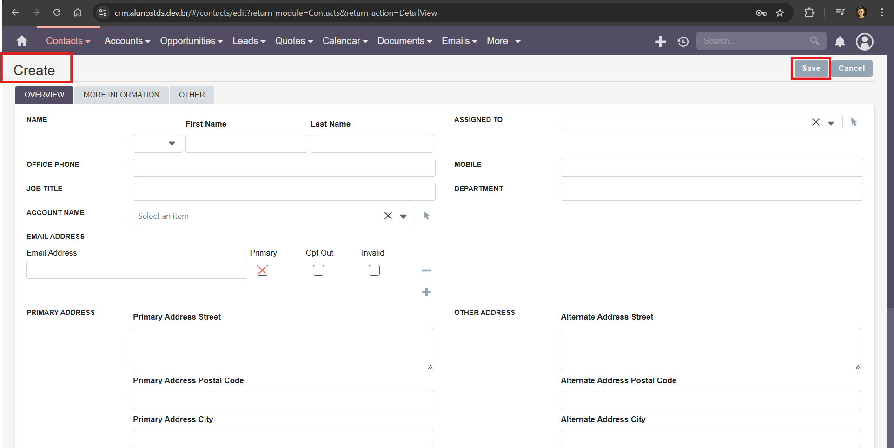

### **Test Case 3 – Create New Contact**

**Date:** 2025-04-18

---

### Description

This test verifies the functionality of the Contacts module by creating a new contact record in SuiteCRM.

### Objective

To ensure that users are able to create new contact entries and that the system only enforces required field validations appropriately.

### What is Being Tested

The "Create Contact" functionality in the Contacts module, including form validation and record creation.

### Prerequisites

- Access to the SuiteCRM instance at [http://crm.alunostds.dev.br](http://crm.alunostds.dev.br) using a supported browser (Chrome, Firefox, or Edge).
- Valid login credentials.

### Test Procedure

1. Log in to SuiteCRM.
2. From the top navigation menu, go to **Contacts > Create Contact**.
3. The app redirects to the URL:
   - [https://crm.alunostds.dev.br/#/contacts/edit?return_module=Contacts&return_action=DetailView](https://crm.alunostds.dev.br/#/contacts/edit?return_module=Contacts&return_action=DetailView)
4. Fill in the necessary details for the new contact.
   - Only the **Last Name** field is required; other fields may be left blank.
5. Click the **Save** button to create the contact.
6. Verify if the contact was created and appears in the contacts list or details view.

### Expected Result

The contact should be created successfully when the last name is provided. If the field is left blank, the system should prompt an error message indicating the field is required.

### Actual Result

The system correctly redirected to the contact creation page. Upon entering only the last name and clicking save, the contact was successfully created. Attempts to save without any data resulted in an appropriate validation message.

### Result Analysis

✅ The test was successful. The contact creation process works as expected, although mandatory fields are not clearly indicated before submission.

### Error Description (if applicable)

Although the system performs proper validation, it does not explicitly indicate which fields are mandatory beforehand. This could lead to usability confusion.

### Evidence

- **System Specifications:**
  - OS: Windows 11 Home Single Language, Version 24H2
  - Build: 26100.3775
  - Experience Pack: 1000.26100.66.0
  - Processor: AMD Ryzen 5 5500U with Radeon Graphics 2.10 GHz
  - RAM: 20.0 GB (15.9 GB usable)
  - System Type: 64-bit
  - Browser: Google Chrome Version 135.0.7049.96 (Official build) 64-bit
  - Screen Resolution: 1920x1080

- **Screenshots and/or Video Evidence:**
  - Create Contact option in Dashboard: 
  
  - Create Contact Menu:
  
  - Create Contact form filled with last name only:
  
  - Validation error when no fields are filled:
  