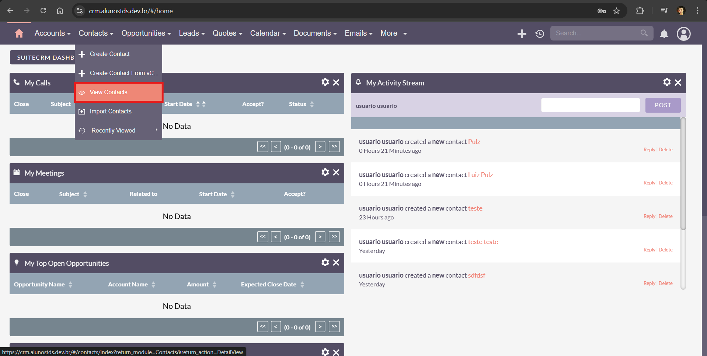
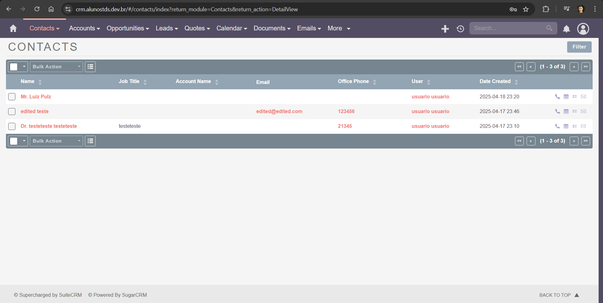
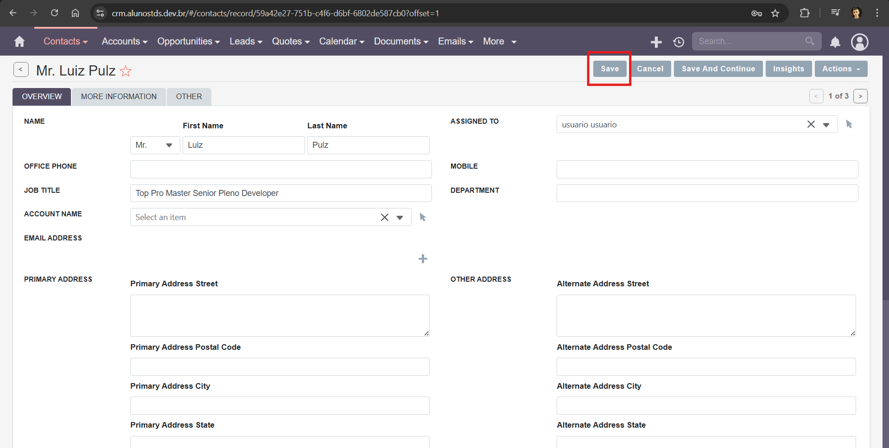

### **Test Case 4 – Edit Existing Contact**

**Date:** 2025-04-18

---

### Description

This test validates the edit functionality within the Contacts module by updating an existing contact's information.

### Objective

To verify that the system allows modifications to an existing contact record and successfully saves and displays the updated data.

### What is Being Tested

The ability to edit and persist changes to contact records in SuiteCRM.

### Prerequisites

- An existing contact must already be present in the system.
- Access to the SuiteCRM instance at [http://crm.alunostds.dev.br](http://crm.alunostds.dev.br) using a supported browser.
- Stable internet connection.

### Test Procedure

1. Navigate to the dashboard at [http://crm.alunostds.dev.br](http://crm.alunostds.dev.br).
2. Go to the top menu and click on **Contacts > View Contacts**.
3. The application redirects to the contact list at:
   - `https://crm.alunostds.dev.br/#/contacts/index?return_module=Contacts&return_action=DetailView`
4. Select an existing contact from the list.
5. Click the **Edit** button.
6. Modify the **Job Title** field.
7. Click **Save** to submit the changes.

### Expected Result

The system should accept the modifications and reflect the updated information on the contact’s detail page.

### Actual Result

The edit was performed successfully. The Job Title field was updated and displayed correctly after saving.

### Result Analysis

✅ The test passed. The application allowed for editing an existing contact, saved the new data, and reflected it correctly.

### Error Description (if applicable)

N/A – No errors occurred.

### Evidence

- ✅ **Edited Field:** Job Title
- **System Specifications:**
  - OS: Windows 11 Home Single Language, Version 24H2
  - Build: 26100.3775
  - Experience Pack: 1000.26100.66.0
  - Processor: AMD Ryzen 5 5500U with Radeon Graphics 2.10 GHz
  - RAM: 20.0 GB (15.9 GB usable)
  - System Type: 64-bit
  - Browser: Google Chrome Version 135.0.7049.96 (Official build) 64-bit
  - Screen Resolution: 1920x1080

- **Screenshots and/or Video Evidence:**
  - View Contact Option:
  
  - View Contact Dashboard:
  
  - Edit Contact Menu:
  