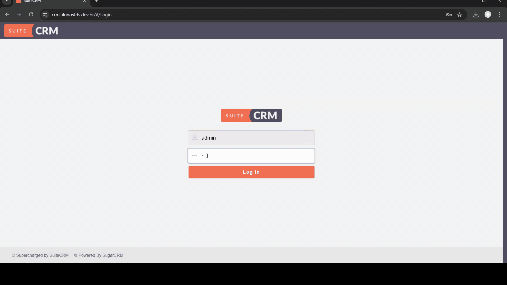

### **Test Case 10 – Access to Restricted Features**

**Date:** 2025-04-21

---

### **Description**

This test evaluates user access control based on different user roles within the SuiteCRM system.

### **Objective**

To verify that users with different permission levels (Admin vs Standard User) have access only to their respective features and are restricted appropriately from accessing unauthorized sections.

### **What is Being Tested**

Role-based access control and visibility of restricted features.

### **Prerequisites**

- Access to the SuiteCRM instance at [http://crm.alunostds.dev.br](http://crm.alunostds.dev.br).
- Two user accounts:
  - Admin User (Username: `admin`, Password: `admin123`)
  - Standard User (Username: `usuario`, Password: `usuario123`)

### **Test Procedure**

1. Log in with the Admin user account.
2. Attempt to access the Admin Panel and other administrative modules.
3. Log out and log in with the Standard user account.
4. Attempt to access the Admin Panel.
5. Observe which features are visible and accessible to each user.

### **Expected Result**

- Admin users should be able to access the Admin Panel and all administrative functionalities.
- Standard users should be restricted from accessing these functionalities and should not see the Admin Panel in their menu.

### **Actual Result**

- Admin user successfully accessed the Admin Panel and related settings.
- Standard user was restricted as expected and could not access the Admin Panel.

### **Result Analysis**

✅ The test passed. Access control is correctly enforced between user roles.

### **Error Description (if applicable)**

N/A – Permissions behaved as expected.

### **Evidence**
- **System Specifications:**
  - OS: Windows 11 Home Single Language, Version 24H2
  - Build: 26100.3775
  - Experience Pack: 1000.26100.66.0
  - Processor: AMD Ryzen 5 5500U with Radeon Graphics 2.10 GHz
  - RAM: 20.0 GB (15.9 GB usable)
  - System Type: 64-bit
  - Browser: Google Chrome Version 135.0.7049.96 (Official build) 64-bit
  - Screen Resolution: 1920x1080

- **Screenshots and/or Video Evidence:**\
    - Video showing the differences in access between user roles:
    
