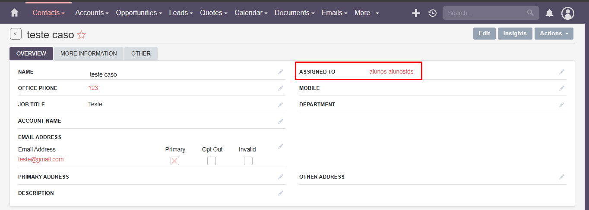

### **Test Case 15 – Task Assignment**

**Date:** 2025-04-21

---

### **Title of the Test:** Task Assignment

### **Description**

This test evaluates the ability to assign tasks to specific users or system attributes within SuiteCRM.

### **Objective**

To test the functionality of assigning tasks to users and verify if corresponding notifications are triggered.

### **What is Being Tested**

Task assignment mechanism and notification system.

### **Prerequisites**

- Access to the SuiteCRM instance at [http://crm.alunostds.dev.br](http://crm.alunostds.dev.br).
- At least one existing task or ability to create a new one.
- Two user accounts available in the system for assignment purposes.

### **Test Procedure**

1. Navigate to **Calendar → Create Task**, or open an existing task for editing.
2. Fill in the required task fields (Subject, Status, Priority).
3. Use the assignment field to select a user or account to assign the task to.
4. Save the task.
5. Attempt to verify whether the assigned user receives a notification.

### **Expected Result**

The task should be successfully assigned to the selected user or account, and the assigned user should receive a notification of the new task.

### **Actual Result**

- The task was successfully assigned to other users or system attributes.
- The notification functionality could not be tested due to unclear configuration.
- The menu interface is unintuitive, making task location and assignment more difficult than expected.

### **Result Analysis**

⚠️ The test partially passed. Task assignment works, but verifying notifications was not possible due to confusing configuration and lack of clarity in the interface.

### **Error Description (if applicable)**

- Email notification system not properly configured or difficult to locate.
- Menus and UI for managing and finding tasks are not user-friendly.

### **Evidence**

- **System Specifications:**
  - OS: Windows 11 Home Single Language, Version 24H2
  - Build: 26100.3775
  - Experience Pack: 1000.26100.66.0
  - Processor: AMD Ryzen 5 5500U with Radeon Graphics 2.10 GHz
  - RAM: 20.0 GB (15.9 GB usable)
  - System Type: 64-bit
  - Browser: Google Chrome Version 135.0.7049.96 (Official build) 64-bit
  - Screen Resolution: 1920x1080

- **Screenshots and/or Video Evidence:**
  - Image with the task assigned to an account:
  
