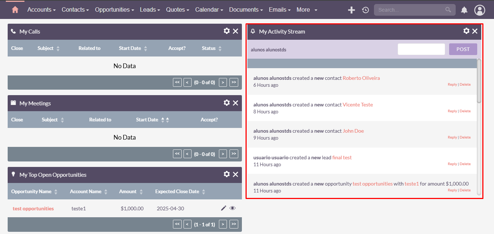

### **Test Case 16 – Notification Generation**

**Date:** 2025-04-24

---

### **Title of the Test:** Notification Generation

### **Description**

This test evaluates whether SuiteCRM appropriately generates in-system notifications following specific user actions, such as record creation or updates.

### **Objective**

To confirm that the system displays proper notifications to users when key actions are performed within the system.

### **What is Being Tested**

Notification triggers following creation or modification of records in the SuiteCRM system.

### **Prerequisites**

- Access to the SuiteCRM instance at [http://crm.alunostds.dev.br](http://crm.alunostds.dev.br)
- A valid user account with permission to create and edit records

### **Test Procedure**

1. Log in to the SuiteCRM system.
2. Create a new contact or record (e.g., a task or lead).
3. Observe whether a notification is shown.
4. Edit an existing contact or record.
5. Observe whether a notification is generated for this update.
6. Check the main dashboard to evaluate the logs and notifications panel.

### **Expected Result**

- The system should generate clear, visible notifications on the screen when records are created or updated.

### **Actual Result**

- No notification is shown upon creation or editing of a record.
- Instead, an activity log is generated and displayed on the lower right side of the main dashboard.

### **Result Analysis**

⚠️ The test is considered complete, but the system lacks user-friendly notification feedback. It only logs activities instead of showing real-time notifications. This could confuse users expecting active visual alerts.

### **Error Description (if applicable)**

- No real-time notification appears.
- Logs are shown in the dashboard instead, occupying a large portion of the lower right side.

### **Evidence**

- **System Specifications:**
  - OS: Windows 11 Home Single Language, Version 24H2
  - Build: 26100.3775
  - Experience Pack: 1000.26100.66.0
  - Processor: AMD Ryzen 5 5500U with Radeon Graphics 2.10 GHz
  - RAM: 20.0 GB (15.9 GB usable)
  - System Type: 64-bit
  - Browser: Google Chrome Version 135.0.7049.96 (Official build) 64-bit
  - Screen Resolution: 1920x1080

- **Screenshots and/or Video Evidence:**
  - Image with the task assigned to an account:
  