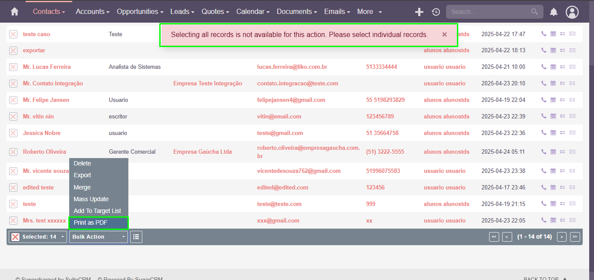

### **Test Case 17 – Custom Report Generation**

**Date:** 2025-04-24

---

### **Title of the Test:** Custom Report Generation

### **Description**

This test aims to evaluate SuiteCRM’s ability to generate customized reports based on registered system data.

### **Objective**

To validate the functionality for generating custom reports using data from different system modules.

### **What is Being Tested**

The system's ability to produce and export customized reports.

### **Prerequisites**

- Access to the SuiteCRM instance at: [http://crm.alunostds.dev.br](http://crm.alunostds.dev.br)
- Modules with previously registered data

### **Test Procedure**

1. Access a data-populated module (e.g., Contacts, Opportunities).
2. Attempt to locate any "Generate Report" feature.
3. Review the available export options.
4. Assess the format and usability of exports (CSV, PDF).
5. Try to generate a report including multiple records or using filters.

### **Expected Result**

The system should allow users to generate customized reports with multiple records, selectable fields, and filter capabilities.

### **Actual Result**

- No clear report generation feature was found.
- The system allows data export via CSV and PDF, with PDF limited to single records.
- CSV export is more useful but requires external tools (e.g., Excel or Power BI) to produce formatted reports.

### **Result Analysis**

⚠️ The system is limited in generating custom reports. It merely allows exporting raw data for processing in other tools. This limitation impacts usability for users who need ready-to-use reports directly from the platform.

### **Error Description (if applicable)**

- No dedicated report-building interface.
- PDF export is limited to single entries.
- External tools are needed to create meaningful reports.

### **Evidence**

- CSV export from the Contacts module: 

- **System Specifications:**
  - OS: Windows 11 Home Single Language, Version 24H2
  - Build: 26100.3775
  - Experience Pack: 1000.26100.66.0
  - Processor: AMD Ryzen 5 5500U
  - RAM: 20.0 GB
  - Browser: Google Chrome Version 135.0.7049.96
  - Screen Resolution: 1920x1080

- **Screenshots and/or Video Evidence:**
  - Image with the PDF limitation:
  