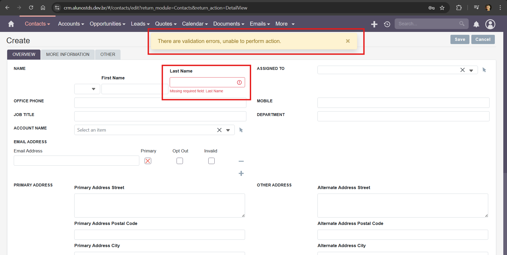

### **Test Case 20 – Required Fields Validation**

**Date:** 2025-04-24

---

### **Title of the Test:** Required Fields Validation

### **Description**

This test aims to verify the system's ability to validate required fields, ensuring users are not able to save incomplete records.

### **Objective**

To confirm that the system prevents the creation of records when required fields are left blank and that it displays appropriate error messages.

### **What is Being Tested**

Field validation and enforcement of required input fields across various modules.

### **Prerequisites**

- Access to the SuiteCRM instance at [http://crm.alunostds.dev.br](http://crm.alunostds.dev.br).
- User credentials with permission to create records in various modules.
- Modules tested: Tasks, Contacts, Accounts, Leads, and Documents.

### **Test Procedure**

1. Navigate to each of the following modules: Tasks, Contacts, Accounts, Leads, and Documents.
2. Attempt to create a new record, leaving one or more required fields blank.
3. Click the **Save** button.
4. Observe the system’s response and error messages.
5. Repeat for all listed modules.

### **Expected Result**

The system should:
- Prevent saving the record.
- Highlight the required fields.
- Display an appropriate error message.

### **Actual Result**

✅ The system correctly enforced validation for required fields across all tested modules. Users were blocked from saving incomplete records and received visible error indicators.

### **Result Analysis**

✅ The test passed. Required field validation is functioning correctly and consistently across major modules.

### **Error Description (if applicable)**

N/A – No errors encountered during this test.

### **Evidence**

- **Modules Tested:** Tasks, Contacts, Accounts, Leads, and Documents
- **Validation Behavior:** Required fields were correctly highlighted and blocked saving.
- **System Specifications:**
  - OS: Windows 11 Home Single Language, Version 24H2
  - Build: 26100.3775
  - Experience Pack: 1000.26100.66.0
  - Processor: AMD Ryzen 5 5500U with Radeon Graphics 2.10 GHz
  - RAM: 20.0 GB (15.9 GB usable)
  - System Type: 64-bit
  - Browser: Google Chrome Version 135.0.7049.96 (Official build) 64-bit
  - Screen Resolution: 1920x1080

- **Screenshots and/or Video Evidence:**
  - Validation error when no fields are filled:
   